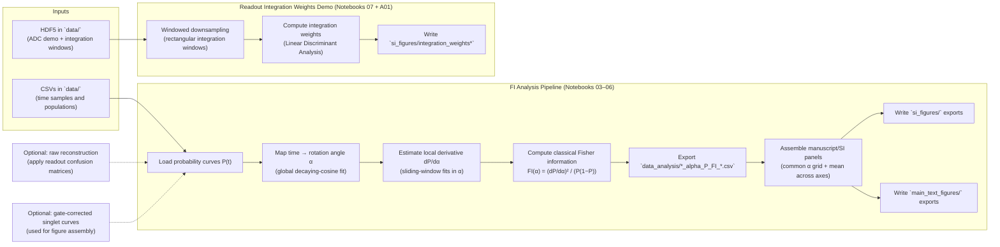
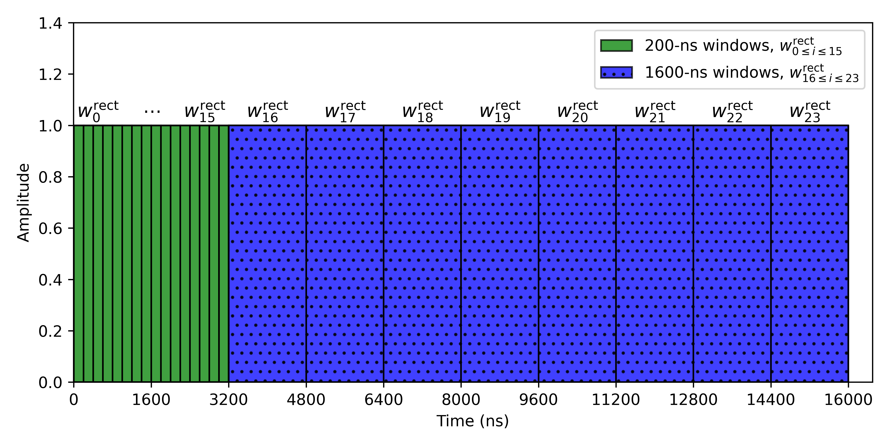
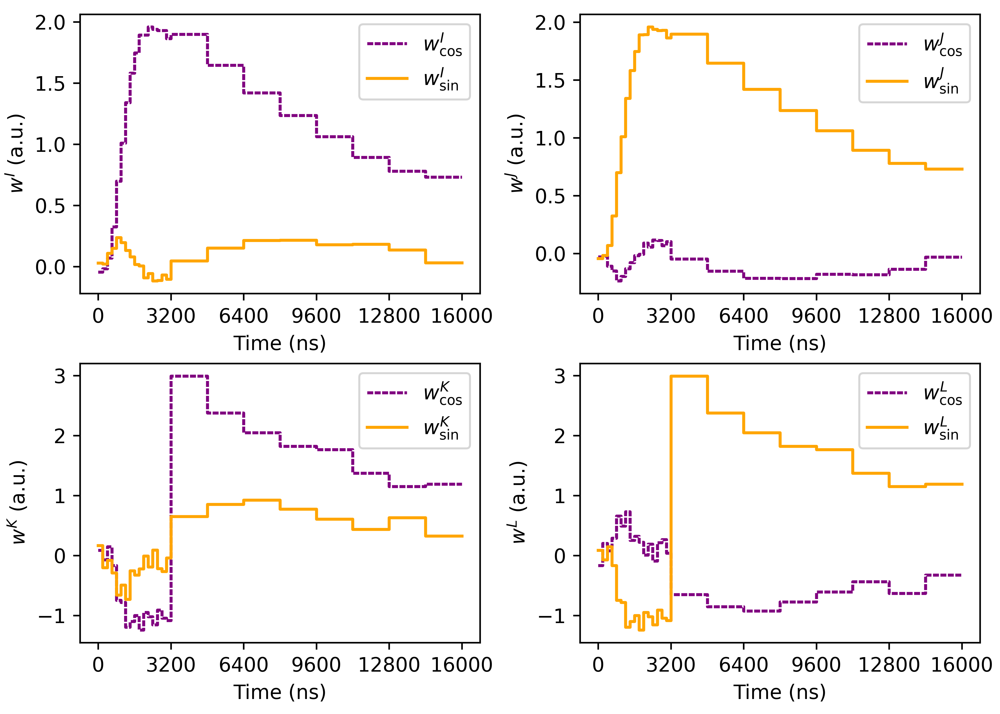
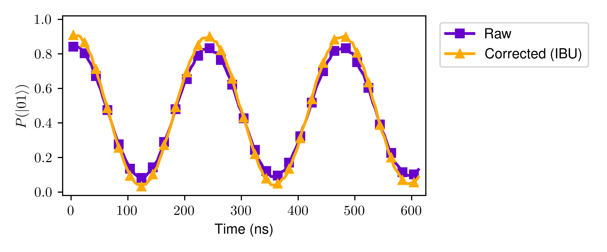

# Positronium Sensing

Repository for the manuscript [Superconducting antiqubits achieve optimal phase estimation via unitary inversion](https://arxiv.org/abs/2506.04315).

This repository is written for **manuscript reviewers and readers who were not involved in the experiments**. The goal is to make the *data-processing and analysis pipeline* crystal clear and reproducible, starting from the released probability datasets (CSV/HDF5) and ending with the figure exports used in the manuscript.

This repository is organized for readers who want to reproduce the analysis end-to-end from the included CSV/HDF5 artifacts:

- `notebooks/` contains the step-by-step analysis notebooks (numbered in recommended run order).
- `data/` contains the minimal experimental probability datasets used by the notebooks.
- `data_analysis/` contains derived `alpha, P, FI` CSV products produced by the notebooks.
- `si_figures/` contains supplementary-information figure exports produced by the notebooks.
- `main_text_figures/` contains figure exports intended for the manuscript main text (for example, Fig. 3).
- `figures/` contains small static assets embedded in notebooks/documentation.

## Analysis overview

### Terminology used throughout the repo
- `t`: experimental time samples (ns in the released CSVs).
- `α` (alpha): rotation angle (radians) obtained from a global fit, used as the analysis x-axis.
- `P(α)`: probability of a measurement outcome as a function of `α`.
- `FI(α)`: (classical) Fisher information computed from `P(α)` using local fits.

The notebooks work with three related probability “styles” for the singlet dataset:
- **readout-corrected** (`original` in filenames): corrected for measurement assignment errors.
- **raw** (`raw` in filenames): reconstructed *uncorrected* measurement probabilities (by applying readout confusion matrices).
- **gate-corrected** (`corrected` in filenames): singlet curves corrected for entangling-gate errors (provided as derived CSVs and used for figure assembly).

### Data-processing workflow (high level)



## Contents

### I. Experimental data (`data/`)

See `data/README.md` for file descriptions.

### II. Notebooks (`notebooks/`)

Run the notebooks in numeric order:

1. `notebooks/01_z_gate_curves_fig2cd.ipynb`
2. `notebooks/02_ac_stark_shift_sweeps_fig2ef.ipynb`
3. `notebooks/03_singlet_readout_corrected_fi_analysis.ipynb`
4. `notebooks/04_singlet_raw_fi_analysis.ipynb`
5. `notebooks/05_singlet_gate_corrected_fi_analysis.ipynb`
6. `notebooks/06_combined_si_figures_and_fig3.ipynb`
7. `notebooks/07_readout_integration_weights_demo.ipynb`
8. `notebooks/08_readout_fidelity_correction_ibu_demo.ipynb`

Optional training-set notebook:
- `notebooks/A01_integration_weights_demo_training_data.ipynb`

Entrypoint notebook (overview + links):
- `positronium_sensing.ipynb`

## Previews

- Rectangular windows for calculating the integration weights


- Integration weights


- Readout fidelity correction


## Requirements

See `requirements.txt`.

## Running in Binder

[](https://mybinder.org/v2/gh/murchlab/positronium-sensing/HEAD?urlpath=lab/tree/positronium_sensing.ipynb)

Click the badge above to launch Binder directly into `positronium_sensing.ipynb`.

## Running locally

```bash
git clone https://github.com/murchlab/positronium-sensing.git
cd positronium-sensing
pip install -r requirements.txt
```

## License

This project is released under the MIT License. See `LICENSE`.

## Cite this work

```BibTeX
@article{positronium2025,
  title         = {Superconducting antiqubits achieve optimal phase estimation via unitary inversion},
  author        = {Song, Xingrui and Borjigin, Surihan Sean and Salvati, Flavio and Wang, Yu-Xin and Yunger Halpern, Nicole and Arvidsson-Shukur, David R. M. and Murch, Kater},
  journal       = {arXiv},
  eprint        = {2506.04315},
  primaryClass  = {quant-ph},
  year          = {2025},
  doi           = {10.48550/arXiv.2506.04315},
  url           = {https://arxiv.org/abs/2506.04315}
}
```
