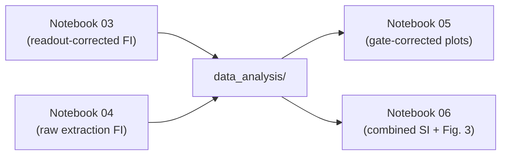

# data_analysis

This folder contains **derived analysis products** generated by the notebooks. These CSVs are the main “hand-off” artifacts between:

- notebooks that *compute* `α`, `P(α)`, and `FI(α)`, and
- notebooks that *assemble* multi-panel figures for the manuscript/SI.

## Common file format: `*_alpha_P_FI_*.csv`

These CSVs have three columns:
- `alpha_rad`: rotation angle `α` in radians.
- `P`: probability of the analyzed outcome as a function of `α` (e.g., `P(|1⟩)` for single-qubit baselines or `P(|01⟩)` for the singlet channel).
- `FI`: classical Fisher information computed from a local fit for `dP/dα` (units of `rad⁻²`).

## Naming patterns
- `Q1_*` / `Q2_*`: single-qubit baseline curves used for comparisons and sanity checks.
- `singlet_*`: two-qubit singlet curves.
- Style tag at the end of the filename:
  - `*_readout_corrected.csv`: readout-corrected probabilities (corrected for assignment errors).
  - `*_raw.csv`: raw/uncorrected probabilities.
  - `*_readout_and_gate_corrected.csv`: gate-fidelity-corrected singlet curves used for figure assembly.

## Additional derived files
- `ACS_f_sweep_*_th_*.csv`: model curves used by the AC Stark shift figure notebook.

These files are consumed primarily by the figure-assembly notebooks (`notebooks/05_*`, `notebooks/06_*`).
