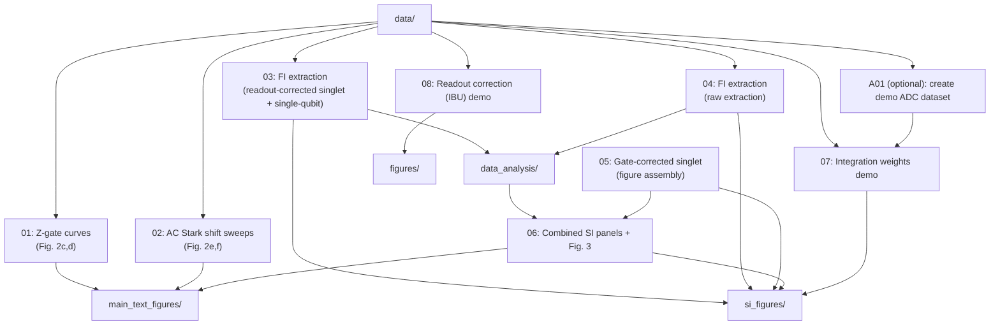

# Notebooks

Run the notebooks in numeric order. Each notebook starts with an overview written for readers who want to understand the **data-processing logic** (not the experimental control stack).

## Dependency overview

## Recommended order (with purpose)
- `01_z_gate_curves_fig2cd.ipynb`: loads single-qubit Rabi datasets and exports the Fig. 2c,d curves.
- `02_ac_stark_shift_sweeps_fig2ef.ipynb`: fits a AC Stark shift model to AC Stark shift sweeps and exports the Fig. 2e,f panels.
- `03_singlet_readout_corrected_fi_analysis.ipynb`: converts `t → α`, extracts `P(α)` and `FI(α)` (readout-corrected), and writes `data_analysis/*_readout_corrected.csv`.
- `04_singlet_raw_fi_analysis.ipynb`: extracts raw probabilities using readout confusion matrices, extracts `FI(α)`, and writes `data_analysis/*_raw.csv`.
- `05_singlet_gate_corrected_fi_analysis.ipynb`: loads gate-corrected singlet `alpha, P, FI` CSVs and exports the corresponding SI panels.
- `06_combined_si_figures_and_fig3.ipynb`: combines the three singlet styles (readout-corrected/raw/gate-corrected) on a shared `α` grid and exports the combined SI panels and Fig. 3.
- `07_readout_integration_weights_demo.ipynb`: demonstrates windowed downsampling + LDA-based integration weights on an included ADC dataset.
- `08_readout_fidelity_correction_ibu_demo.ipynb`: demonstrates Iterative Bayesian Update (IBU) readout-fidelity correction on an included dataset.

Optional:
- `A01_integration_weights_demo_training_data.ipynb`
