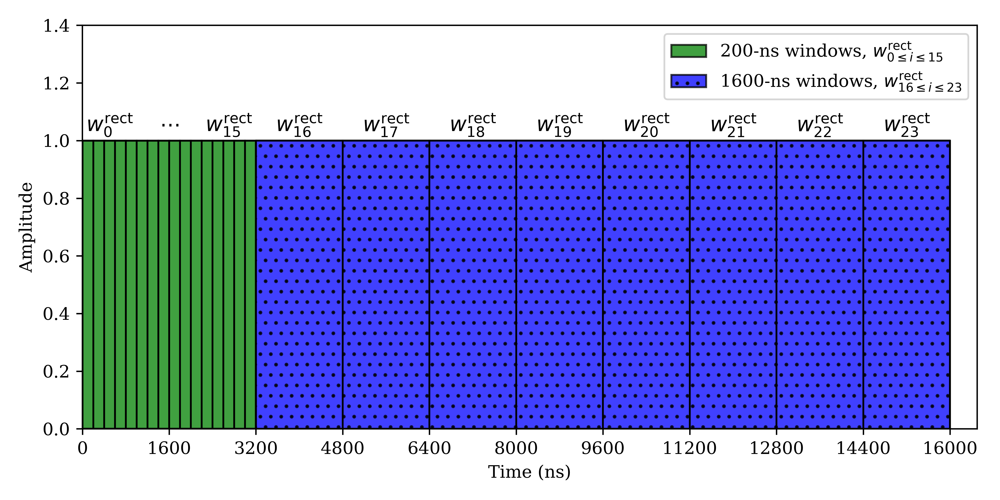
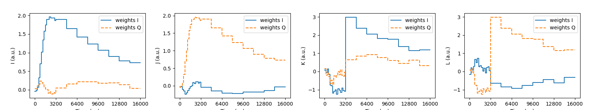
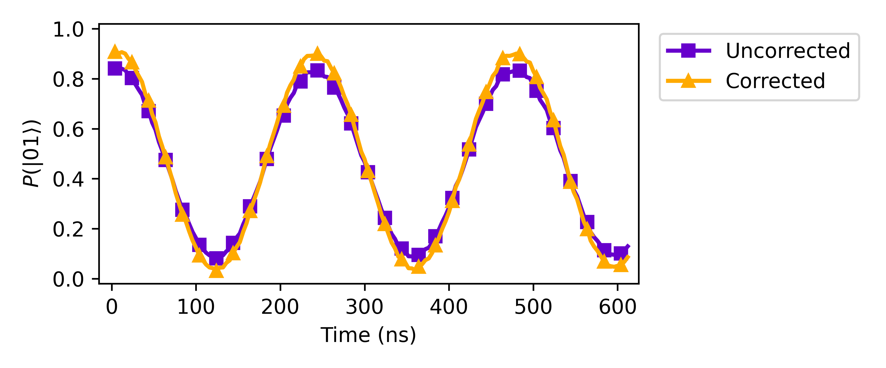

# Positronium Sensing

Repository for the manuscript [Superconducting antiqubits achieve optimal phase estimation via unitary inversion](https://arxiv.org/abs/2506.04315). This repo contains the analysis scripts and data generated by the experiment, clarifying which parts of the results are corrected for readout fidelity and which features are intrinsic to the antiqubit-based sensing mechanism introduced in the paper.

## Contents

### I. Experimental data

Raw experimental data are stored in the `/Data` folder in `.csv` format.

### II. Notebooks

1. Fisher information analysis
2. Readout integration weights
3. Readout fidelity correction based on Iterative Bayesian Update (IBU)

## Previews

- Rectangular windows for calculating the integration weights


- Integration weights


- Readout fidelity correction


## Requirements

- Python 3.7+
- NumPy
- SciPy
- Matplotlib
- H5py
- Nevergrad (optional for reproducing the demo ADC dataset)

## Running in Binder

You can launch the interactive notebook environment for this project directly in your browser via Binder. This allows you to run the data analysis without any local installation.

[](https://mybinder.org/v2/gh/murchlab/positronium-sensing/HEAD)

Click the badge above to open the `positronium_sensing.ipynb` notebook in a live Binder session

## Running locally

```bash
git clone https://github.com/murchlab/positronium-sensing.git
cd positronium-sensing
pip install -r requirements.txt
```

## License

This project is released under the [MIT](https://github.com/murchlab/positronium-sensing/blob/main/LICENSE) License.

## Cite this work
```BibTeX
@article{positronium2025,
  title         = {Superconducting antiqubits achieve optimal phase estimation via unitary inversion},
  author        = {Song, Xingrui and Borjigin, Surihan Sean and Salvati, Flavio and Wang, Yu-Xin and Yunger Halpern, Nicole and Arvidsson-Shukur, David R. M. and Murch, Kater},
  journal       = {arXiv},
  eprint        = {2506.04315},
  primaryClass  = {quant-ph},
  year          = {2025},
  doi           = {10.48550/arXiv.2506.04315},
  url           = {https://arxiv.org/abs/2506.04315}
}